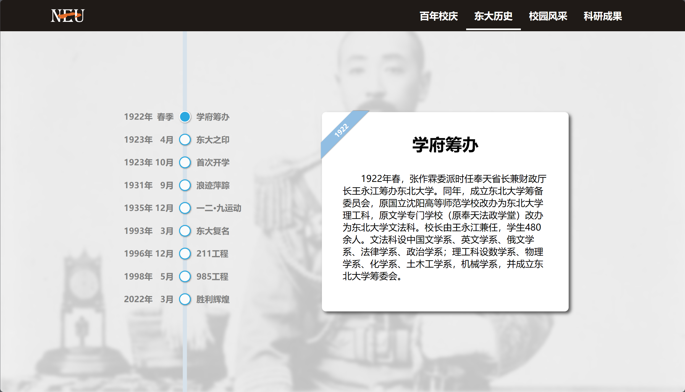
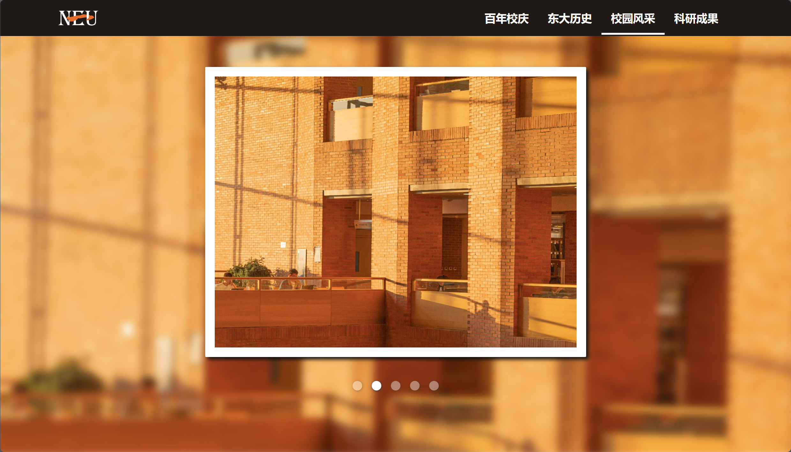
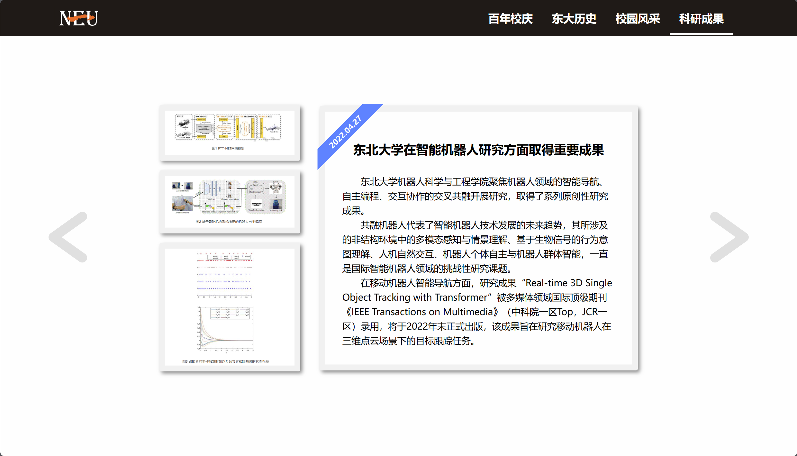

# NEU 100th Anniversary

本项目是为庆祝东北大学百年校庆而开发的单页应用网站，采用 Vue 框架开发，并遵循 MIT 许可证进行开源。

## 安装方法

在开始安装之前，请确保您已安装以下工具：

- Node.js (建议使用最新的 LTS 版本)

完成后，按照以下步骤进行项目的安装：

1. 克隆项目到本地

```bash
git clone https://github.com/nanoyou/neu-100th-anniversary
```

2. 进入项目目录

```bash
cd neu-100th-anniversary
```

3. 安装项目依赖

```bash
npm install
```

## 使用

完成安装后可以通过如下操作运行本项目：

### 使用开发服务器

1. 启动开发服务器

```bash
npm run dev
```

2. 在浏览器中打开 `http://localhost:5173/neu-100th-anniversary/` 进入网页

### 编译并部署到 Web 服务器上

1. 编译项目

```bash
npm run build
```

2. 将 `dist` 目录下的内容放入 Nginx、Apache 等 Web 服务器内，也可以使用 Live Server 等工具快速启动一个临时的 Web 服务器

3. 运行 Web 服务器

## 图片展示






